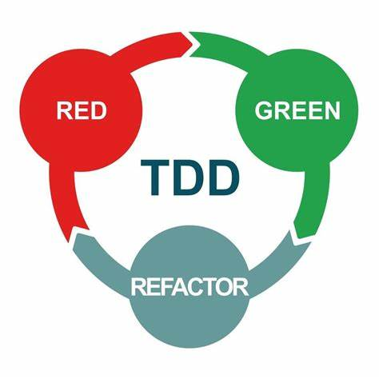

# Basic Syntax

Pallat Anchaleechamaikorn
Go Developer

yod.pallat@gmail.com
https://github.com/pallat
https://dev.to/pallat

https://go.dev/tour
https://github.com/uber-go/guide

---

## Getting Started

### Official Golang Page

https://go.dev/
https://go.dev/tour

---

<style scoped>
    li {
        font-size: 0.8rem;
    }
</style>

## outline

- Installations
- Go toolchain to build and run
- Syntax and Control structure
- Testing and TDD
- Packages
- Interface
- First-Class Function
- Higher-Order Function
- Closure Function
- Goroutine & Channel
- Simple API with net/http

---

## Go vs Golang


---

## Go Users

https://github.com/golang/go/wiki/GoUsers

---

## Installation

https://dev.to/pallat/install-go-4a1a

---

## Download

https://go.dev/

---

## OS Environment

.profile .zshrc

```sh
GOROOT=$HOME/{go package}
GOPATH=$HOME/go
GOBIN=$GOPATH/bin
PATH=$GOROOT/bin:$GOBIN:$PATH
```

```sh
GOROOT=/Users/pallat/sdk/go
GOPATH=/Users/pallat/go
GOBIN=$GOPATH/bin
PATH=$GOROOT/bin:$GOBIN:$PATH
```

---

## Go Toolchain

### Go Environment

```sh
go env
```

---

## Visual Studio Code

---

## Initial a project

### linux/Macbook

```sh
mkdir hello && cd hello
```

### windows

```sh
md hello
cd hello
```

---

## Open VS Code

```
code .
```

---

## Initial go module

```sh
go mod init hello
```

or

```sh
go mod init github.com/pallat/hello
```

go.mod

```go
    module hello

    go 1.17
```

---

## Hello World

run

```sh
go run main.go
```

---

## Basic syntax - Variable declaration

```go
var s string
var i int
var ok bool
var f float64
```

---

## Zero Value

| value | type |
|-------|------|
| **0** | _numeric_ |
| **false** | _boolean_ |
| **""** | _string_ |
| **nil** | _pointer_ |

---

## Basic syntax - Variable declaration(2)

### Declaration with initial value

```go
var s string = "Hello World"
var i int = 9
var ok bool = true
var f float64 = 1
```

---

## Basic syntax - Variable declaration(3)

### Type inference

```go
var s = "Hello World"
var i = 9
var ok = true
var f = 1.0
```

---

## Basic syntax - Variable declaration(4)

### Type inference without var keyword

```go
s := "Hello World"
i := 9
ok := true
f := 1.0
```

*Only* *in* *Functions*

---

## Basic Syntax - Functions

```go
    func add(a int, b int) int {
        return a + b
    }

    func add(a, b int) int {
        return a + b
    }
```

---

## Exercise - Area of a Square Function

```go
func squareArea(a float64) float64 {

}
```

---

## Basic Syntax - Functions with no return

```go
    func printAdded(a, b int) {
        fmt.Println(a + b)
    }
```

---

## Basic Syntax - Functions multiple return values

```go
    func swap(a, b int) (int,int) {
        return b, a
    }
```

---

## Basic syntax - Control Flow if/else

```go
    if a != b {
        println("a not equal to b")
    } else if a < b {
        println("a less than b")
    } else {
        println("ok")
    }
```

---

## Basic syntax - Control Flow if/else with statement

```go
    if ok := IsCorrect(); ok {
        println("It's correct")
    }

    if n, err := strconv.Atoi("5"); err != nil {
        log.Println(err)
    } else {
        log.Printf("the number is %d\n", n)
    }
```

---

## Basic syntax - loop

```go
    for i := 0; i < 10; i++ {

    }

    for i <= 10 {

    }

    for {
        
    }
```

---

## Demo - Prime factor

print prime number in 1..100

---

## Excercise - Exponentiation (Power)

$
b^{x} = \underbrace {b\times \dots \times b} _{x{\text{ times}}}.
$

```go
func power(base, exponent int) int
```

---

<!-- Scoped style -->
<style scoped>
section p {
    font-size: 20px;
}
section code {
    font-size: 18px;
}
</style>

## Pointer

Go has pointers. A pointer holds the memory address of a value.
The type *T is a pointer to a T value. Its zero value is nil.

```go
var p *int
```

The & operator generates a pointer to its operand.

```go
i := 42
p = &i
```

The # operator denotes the pointer's underlying value.

```go
fmt.Println(*p) // read i through the pointer p
*p = 21         // set i through the pointer p
```

This is known as "dereferencing" or "indirecting".
Unlike C, Go has no pointer arithmetic.

---

## Example Pointer

```go
    var p *int
    i := 42
    p = &i

    fmt.Println(*p, i)

    *p = 43
    fmt.Println(*p, i)
```

---

## new

```go
    var p = new(int)
    i := 42
    p = &i

    fmt.Println(*p, i)

    *p = 43
    fmt.Println(*p, i)
```

---

## Packages

### Keyword: package

rules

    only one package in any directory except testing file can plus suffix _test in there

    exposed name begins with capital charactor

---

## Exposed name

---

## Unit testing in go

### 3 Conditions

1. filename has suffix **_test.go**
2. function name prefix is **Test**
3. the test function only get 1 parametter type ***testing.T**

```go
    import "testing"

    func TestACase(t *testing.T) {

    }

    func Test_a_case(t *testing.T) {

    }
```

---

## TDD

### Test Driven Development



---

<style scoped>
section em {
  text-align: center;
  font-style: normal;
  font-size: 40px;
  font-weight: bold;
  text-shadow: 1px 2px 1px #ababab;
  color: #00ADD8
}
section strong {
  font-style: normal;
  font-size: 40px;
  font-weight: bold;
  text-shadow: 1px 2px 1px #ababab;
  color: #CE3263
}
section p {
  text-align: center;
  font-style: normal;
  font-size: 40px;
  font-weight: bold;
  text-shadow: 1px 2px 1px #ababab;
  color: #FDDD00
}
</style>

## Unit testing

### AAA Pattern

*Arrange* **Act** Assert

---

## AAA

```go
given := 1
want := "1"

get := act(given)
if want != get {
    // error report
}
```

---

## TDD with the Foo/Bar problem

Foo/Bar

    given 1 want "1"

---

## problem #2

    given 2 want "2"

---

## problem #3

    given 3 want "Foo"

---

## problem #4

    given 4 want "4"

---

## problem #5

    given 5 want "Bar"

---

## problem #6

    given 6 want "Foo"

---

## problem #7

    given 7 want "7"

---

## problem #8

    given 8 want "8"

---

## problem #9

    given 9 want "Foo"

---

## problem #10

    given 10 want "Bar"

---

## problem #15

    given 15 want "FooBar"

---

## problem #30

    given 30 want "FooBar"

---

## Types

basic type

```go
    bool

    string

    int  int8  int16  int32  int64

    uint uint8 uint16 uint32 uint64 uintptr

    byte  // alias for uint8

    rune  // alias for int32
          // represents a Unicode code point

    float32 float64

    complex64 complex128
```

---

[Next >](./data_structure.md#1)
